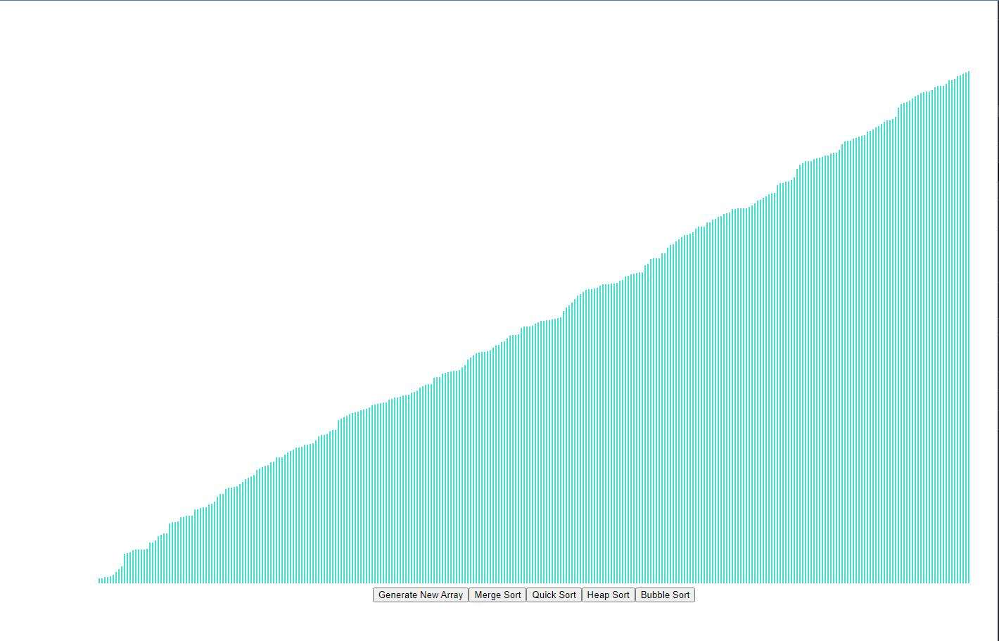

This project is meant to be a tutorial for Clement Mihailescu's [Sorting Visualizer project]

This project was bootstrapped with [Create React App](https://github.com/facebook/create-react-app).

To Run the project: cd to project folder and type npm start and npm run.
<ul>
<li>This project Visually demonstrates merge sort technique.
 <li>Generate array button generates a random array whose height is represented as blocks or histograms
 <li>Sort option then sorts the array. You can Visually see the sorting process.
</ul>
